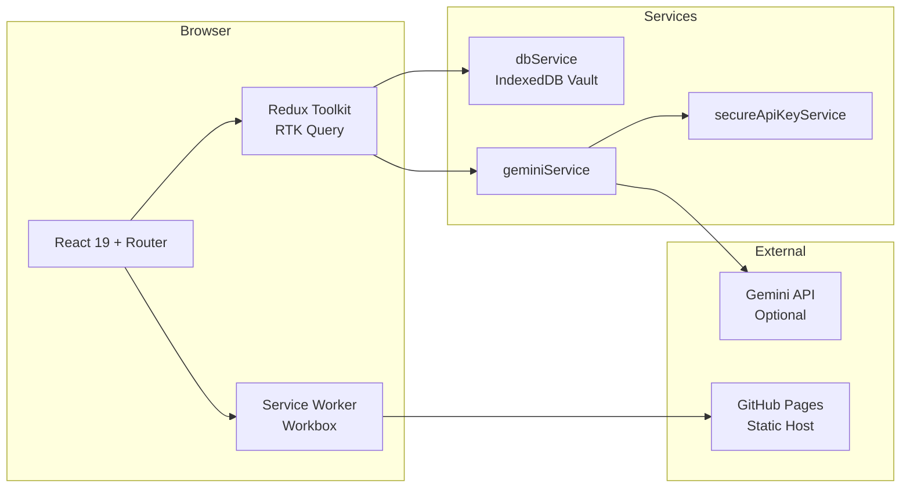
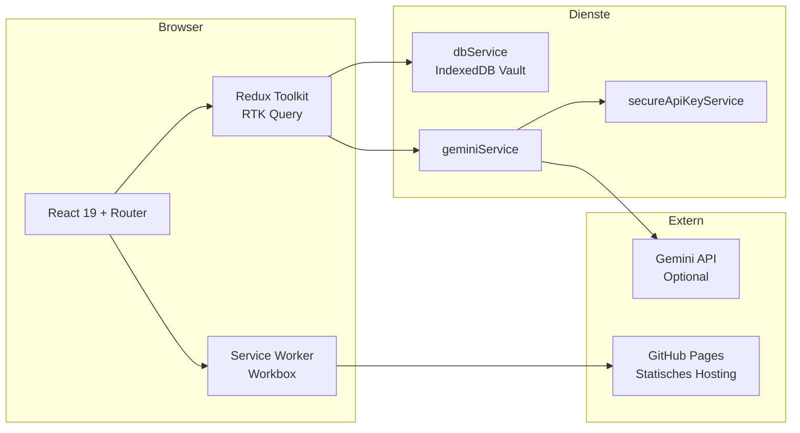

```text

  ░░░░░░░░░░░░░░░░░░░░░░░░░░░░░░░░░░░░░░░░░░░░░░░░░░░░░░░░░░░░░░░░░░░░░░░░░░░░░░░░
  ░ ╔══════════════════════════════════════════════════════════════════════════════╗ ░
  ░ ║  ░▒▓█  S Y N T H - N E T  ·  U P L I N K  v4.0  ·  C H A N N E L  0xDD  █▓▒░  ║ ░
  ░ ╠══════════════════════════════════════════════════════════════════════════════╣ ░
  ░ ║                                                                            ║ ░
  ░ ║    ██████╗ ██╗███████╗██╗███╗   ██╗███████╗ ██████╗                        ║ ░
  ░ ║    ██╔══██╗██║██╔════╝██║████╗  ██║██╔════╝██╔═══██╗                       ║ ░
  ░ ║    ██║  ██║██║███████╗██║██╔██╗ ██║█████╗  ██║   ██║  ┌────────────────┐   ║ ░
  ░ ║    ██║  ██║██║╚════██║██║██║╚██╗██║██╔══╝  ██║   ██║  │ MEDIA LITERACY │   ║ ░
  ░ ║    ██████╔╝██║███████║██║██║ ╚████║██║     ╚██████╔╝  │   RESEARCH &   │   ║ ░
  ░ ║    ╚═════╝ ╚═╝╚══════╝╚═╝╚═╝  ╚═══╝╚═╝      ╚═════╝   │ ANALYSIS  HUB  │   ║ ░
  ░ ║              ██████╗ ███████╗███████╗██╗  ██╗           └────────────────┘   ║ ░
  ░ ║              ██╔══██╗██╔════╝██╔════╝██║ ██╔╝                              ║ ░
  ░ ║              ██║  ██║█████╗  ███████╗█████╔╝    ┌──┐ ┌──┐ ┌──┐ ┌──┐       ║ ░
  ░ ║              ██║  ██║██╔══╝  ╚════██║██╔═██╗    │▓▓│ │▒▒│ │░░│ │  │       ║ ░
  ░ ║              ██████╔╝███████╗███████║██║  ██╗   │▓▓│ │▒▒│ │░░│ │  │       ║ ░
  ░ ║              ╚═════╝ ╚══════╝╚══════╝╚═╝  ╚═╝   └──┘ └──┘ └──┘ └──┘       ║ ░
  ░ ║                                                                            ║ ░
  ░ ║  ╔════════════════╦═════════════════╦════════════════════════════════════╗   ║ ░
  ░ ║  ║  TRUTH-GRID    ║   DISINFODESK   ║   OFFLINE-FIRST // HASH-ROUTED   ║   ║ ░
  ░ ║  ╚════════════════╩═════════════════╩════════════════════════════════════╝   ║ ░
  ░ ║  ░▒▓█ SIGNAL:STABLE · MODE:SYNTH-TERMINAL × CYBERPUNK · ONLINE █▓▒░       ║ ░
  ░ ╚══════════════════════════════════════════════════════════════════════════════╝ ░
  ░░░░░░░░░░░░░░░░░░░░░░░░░░░░░░░░░░░░░░░░░░░░░░░░░░░░░░░░░░░░░░░░░░░░░░░░░░░░░░░░

```

<p align="center">
  <a href="#-english">🇬🇧 English</a> • <a href="#-deutsch">🇩🇪 Deutsch</a>
</p>

<p align="center">
  <a href="https://github.com/qnbs/DisinfoDesk/actions/workflows/ci-cd.yml"></a>
  <a href="https://github.com/qnbs/DisinfoDesk/actions/workflows/e2e.yml"></a>
  <a href="https://github.com/qnbs/DisinfoDesk/blob/main/LICENSE"></a>
  
  
  
  
  
</p>

---

# 🇬🇧 English

# DisinfoDesk

> ⚠️ **Educational purposes only**  
> This project serves media literacy and disinformation analysis. No medical, legal, or psychological advice. Comply with local laws and independently verify all content.

Interactive, local, and offline-capable research PWA for investigating myths, conspiracy narratives, authors, and media references. DisinfoDesk combines curated datasets with optional AI-powered analysis – strictly client-side and local-first.

## Live Demo
- https://qnbs.github.io/DisinfoDesk/

## Table of Contents
- [Value Proposition](#value-proposition)
- [Key Capabilities](#key-capabilities)
- [Architecture Snapshot](#architecture-snapshot)
- [Tech Stack](#tech-stack)
- [Security & Privacy Model](#security--privacy-model)
- [Local Development](#local-development)
- [Production Build](#production-build)
- [GitHub Pages Deployment](#github-pages-deployment)
- [Runtime Configuration](#runtime-configuration)
- [PWA & Offline Behavior](#pwa--offline-behavior)
- [Operational Runbook](#operational-runbook)
- [CI/CD Pipeline](#cicd-pipeline)
- [UI/UX Audit Results](#uiux-audit-results)
- [Troubleshooting](#troubleshooting)
- [Governance & Responsible Use](#governance--responsible-use)
- [Contributing](#contributing)
- [License](#license)

## Value Proposition

| | Principle | Description |
|---|-----------|-------------|
| 🎓 | **Educational Simulation** | Focus on media literacy, not activism, therapy, or counseling |
| 🔒 | **Local-First by Default** | All persistence and caching designed for local control and offline usage |
| 🤖 | **Client-Side AI** | Gemini features are optional — only activate with a locally stored API key |
| 🔍 | **Research UX** | Hash routing, structured detail pages, search/filter flows, narrative cross-references |
| ♿ | **Accessible** | WCAG 2.2 AA compliant — 48×48px touch targets, focus indicators, reduced motion support |
| 🌐 | **Bilingual** | Full EN/DE interface with runtime language switching |

## Key Capabilities

| Module | Description | Route |
|--------|------------|-------|
| 📚 **Theory Archive** | Structured exploration of conspiracy narratives, myths, and disinformation entities | `/#/archive` |
| 👤 **Authors Library** | Profiles with influence dimensions, timelines, and cross-linked content | `/#/authors` |
| 📡 **Media Analysis** | Cultural/media objects with context layers and source associations | `/#/media` |
| 🗣️ **Debunk Chat** | *"Dr. Veritas"* — skeptical AI dialogue with optional context packages | `/#/chat` |
| 🎭 **Satire Generator** | Didactic contrast mode for recognizing manipulative rhetorical patterns | `/#/satire` |
| 🔐 **Vault Operations** | Local encrypted storage, import/export workflows, PWA-capable offline operation | `/#/database` |
| 🌊 **Viral Simulation** | Narrative spread simulation with undo/redo history | `/#/simulation` |
| 📊 **Dashboard** | Aggregated overview of all datasets and research metrics | `/#/` |

## Architecture Snapshot



| Layer | Technology | Role |
|-------|-----------|------|
| **Frontend** | React 19 · TypeScript · Vite | SPA with hash routing (`/#/...`) |
| **State** | Redux Toolkit · RTK Query · redux-persist · redux-undo | Normalized stores, API cache, undo history |
| **Persistence** | IndexedDB Vault (`dbService.ts`) | Compression + AES-GCM encryption pipeline |
| **AI Boundary** | `geminiService.ts` → `@google/genai` | Single integration point for all Gemini calls |
| **PWA Runtime** | Workbox `sw.js` | CacheFirst / StaleWhileRevalidate / NetworkFirst strategies |
| **Routing** | `createHashRouter` | GitHub Pages compatible deep links |

## Tech Stack

| Category | Technologies |
|----------|-------------|
| **Runtime** | React 19 · React Router 6 · Redux Toolkit 2 · RTK Query |
| **Language** | TypeScript 5.8 (strict null-safe patterns) |
| **Build** | Vite 6 · esbuild · manual chunk splitting |
| **Visualization** | Recharts (lazy-loaded) |
| **AI** | `@google/genai` SDK · Gemini 2.0 Flash |
| **UI** | Tailwind CSS (CDN) · `lucide-react` icons |
| **PWA** | Workbox 7 · IndexedDB · BroadcastChannel |
| **Quality** | ESLint · Vitest · Lighthouse CI · CodeQL |

## Security & Privacy Model

### Gemini API Key Handling
- The Gemini API key is **not** injected into bundles via build environment variables.
- Key configuration occurs at runtime in **Settings → Privacy**.
- Storage is locally encrypted in IndexedDB via `secureApiKeyService`.
- Missing keys explicitly trigger a runtime error with UI notification.

### Vault & Data-at-Rest
- Persistent app data runs through IndexedDB (`DisinfoDesk_Vault`).
- Vault pipeline uses Compression + AES-GCM-based encryption/decryption.
- Multi-tab synchronization via `BroadcastChannel`.

### Key Hardening Recommendations
- Restrict API key in Google AI Studio to `*.github.io`.
- Set appropriate quotas/rate limits.
- Rotate immediately if leak is suspected.

## Local Development
```bash
npm ci
npm run dev
```

Local dev server runs on port `3000` by default.

## Production Build
```bash
npm run build
npm run preview
```

Build characteristics:
- Minification via `esbuild`.
- Source maps disabled in production build.
- Chunking/asset hashing for cache busting.
- Repo-based `base` path for GitHub Pages (`/DisinfoDesk/`).

## GitHub Pages Deployment

### CI Workflow
- Workflow: `.github/workflows/deploy.yml`
- Trigger: `push` to `main` + manual (`workflow_dispatch`)
- Actions: Checkout, Node LTS Setup, `npm ci`, `npm run build`, Artifact Upload, Pages Deploy

### Setup Steps
1. Push repository to `main`.
2. In GitHub: Enable **Settings → Pages → Source: GitHub Actions**.
3. Run/wait for **Deploy to GitHub Pages** workflow.
4. Live at: https://qnbs.github.io/DisinfoDesk/

### SPA Fallback on Pages
- `404.html` redirects to hash routes (`/DisinfoDesk/#/...`).
- This enables direct deep links on static hosting.

## Runtime Configuration

### Environment Files
- `.env.example` documents the runtime hint.
- Key point: The Gemini key is set **in the app**, not at build time.

### Setting Gemini Key
1. Open the app.
2. Navigate to **Settings → Privacy**.
3. Save API key.
4. Verify "Stored encrypted" status indicator.

## PWA & Offline Behavior

### Manifest
- `start_url` and `scope` are aligned to `/DisinfoDesk/`.
- App shortcuts point to hash-based targets.

### Service Worker (`sw.js`)
- Workbox `CacheFirst` for images/fonts.
- `StaleWhileRevalidate` for scripts/styles/CDN assets.
- `NetworkFirst` for Gemini API calls with timeout.
- Navigation fallback to `index.html` within registered scope.

### Practical Offline Test
1. Open page once while online.
2. DevTools → Network → Offline.
3. Verify navigation in already cached areas.

## Operational Runbook

### Standard Release Flow
1. Local `npm ci && npm run build`.
2. Merge to `main`.
3. Monitor deploy workflow.
4. After go-live: hard refresh + verify SW update.

### Post-Deploy Checks
- Start page loads without 404.
- Assets arrive with correct base path.
- Hash routes (`#/archive`, `#/media`, `#/authors`) work.
- PWA installability still available.
- Gemini functionality testable with locally set key.

### Performance/Quality Baselines (Recommendation)
- Run Lighthouse (mobile/desktop) against production URL.
- Focus: Performance, Accessibility, Best Practices, PWA.
- For SW changes: increment `CACHE_SUFFIX` to force clean invalidation.

## CI/CD Pipeline

This repository uses a complete CI/CD pipeline with GitHub Actions.

### Workflows

| Workflow | File | Trigger | Description |
|----------|------|---------|-------------|
| **CI/CD Pipeline** | `ci-cd.yml` | Push/PR to `main` | Lint → TypeCheck → Test → Build → Lighthouse → Deploy |
| **E2E Tests** | `e2e.yml` | Push/PR to `main` | Playwright Chromium: Chat, Matrix, Offline, A11y (15 tests) |
| **CodeQL Security** | `codeql.yml` | Push/PR + Weekly | Automatic security analysis for JS/TS |
| **Dependabot** | `dependabot.yml` | Weekly | Automatic dependency updates |

### CI Job (runs on every Push/PR)
1. **Lint:** ESLint with TypeScript rules (fail-fast)
2. **TypeCheck:** Strict TypeScript compilation check
3. **Test:** Vitest unit tests
4. **Build:** Vite production build
5. **Lighthouse:** Performance, Accessibility, SEO, PWA audit with budgets

### Deploy Job (only on `main` after successful CI)
- Artifact download from CI job
- GitHub Pages deployment via `deploy-pages@v4`

### Local Validation
```bash
npm run lint          # ESLint
npm run typecheck     # TypeScript
npm run test          # Vitest (watch mode)
npm run test:ci       # Vitest (single run)
npm run build         # Production build
```

### Lighthouse Budgets
The `lighthouserc.json` defines performance budgets:
- Performance: ≥85
- Accessibility: ≥90 (error threshold)
- Best Practices: ≥90
- SEO: ≥90
- PWA: ≥80

## UI/UX Audit Results

### Accessibility (WCAG 2.2 AA)

| Criterion | Status | Implementation |
|-----------|--------|----------------|
| **Touch Targets** | ✅ | Minimum 48×48px for all interactive elements via `min-w-[48px] min-h-[48px]` |
| **Color Contrast** | ✅ | Text-Muted uses `slate-400` (4.6:1 ratio) instead of `slate-500` (3.5:1) |
| **Focus Indicators** | ✅ | `focus-visible` ring with 2px offset, cyan/purple accent |
| **Skip Navigation** | ✅ | Skip-to-main-content link for keyboard users |
| **Screen Reader** | ✅ | ARIA labels, roles, live regions for dynamic content |
| **Reduced Motion** | ✅ | `prefers-reduced-motion` disables animations |

### Touch & Mobile UX

| Component | Improvement |
|-----------|-------------|
| **Button** | `min-h-[48px]` instead of fixed `h-8`/`h-10` |
| **Close Buttons** | 48×48px touch area with `touch-action-manipulation` |
| **View Toggles** | Icon buttons with 48×48px touch area |
| **Search Clear** | 36×36px touch area with aria-label |

### Loading States

| Feature | Implementation |
|---------|----------------|
| **Skeleton Variants** | `text`, `card`, `avatar`, `image` with different heights |
| **Shimmer Animation** | CSS `shimmer-loading` with 1.5s smooth gradient |
| **Reduced Motion** | Shimmer respects `prefers-reduced-motion` |
| **ARIA** | `role="status"` + `aria-label="Loading..."` |

### Micro-Interactions

| Element | Animation |
|---------|-----------|
| **Buttons** | Smooth 150ms color/border transitions |
| **Cards** | Hover with border-color + shadow transition |
| **Modals** | Fade-in/scale entrance with reduced-motion awareness |
| **Toast Notifications** | Slide-in/out with 300ms timing |

### CSS Utilities Added

```css
.touch-target-min { min-width: 48px; min-height: 48px; }
.text-muted { color: rgb(148 163 184); }        /* 4.6:1 contrast */
.text-muted-strong { color: rgb(203 213 225); } /* 8.9:1 contrast */
.shimmer-loading { /* animated gradient overlay */ }
.transition-smooth { transition: all 150ms ease-out; }
```

## Troubleshooting

### Blank Page After Deploy
- Verify `base` in `vite.config.ts` points to repo path.
- Update browser cache + service worker.

### Assets Not Loading (404)
- Ensure GitHub Pages is deployed via Actions.
- Check build output in `dist/` and workflow artifact.

### SPA Routing Breaks on Reload
- `404.html` must exist in repository root.
- Hash fallback to `/DisinfoDesk/#/...` must not be removed.

### Gemini Features Fail
- API key stored in Settings?
- Domain restriction in AI Studio correct (`*.github.io`)?
- Quota/rate limit reached?

### PWA Update Not Applied
- Trigger UI update hint and confirm "Reload".
- If needed: hard reload and manually remove old SW.

## Governance & Responsible Use
- Not a substitute for medical, legal, psychological, or security-relevant advice.
- Content serves education, analysis, and critical reflection.
- Users bear responsibility for compliance with local laws and platform rules.
- Always independently verify sources and claims.

## Contributing
Contributions welcome — preferably in small, traceable PRs.

### Principles
| Principle | Guideline |
|-----------|-----------|
| 📝 **Docs-first** | Update README and copilot-instructions with behavioral changes |
| 🔒 **Security-first** | No secrets, no build-time key injection, runtime-only API keys |
| 📴 **Offline-first** | Never regress PWA, subpath, or hash-routing compatibility |
| 🧱 **State consistency** | Maintain Redux normalization, entity adapters, and persistence patterns |
| ♿ **Accessible** | All interactive elements ≥48×48px, focus-visible, reduced-motion aware |

### Quality Gates
```bash
npm run lint          # ESLint — must pass with 0 errors
npm run typecheck     # TypeScript — must pass with 0 errors
npm run test:ci       # Vitest — all tests must pass
npm run build         # Vite — production build must succeed
```

## Roadmap
- [x] Full `strict: true` TypeScript migration
- [x] E2E testing with Playwright (15 tests: chat, matrix, offline, a11y)
- [x] React 19 Compiler integration with `babel-plugin-react-compiler`
- [x] PDF export for reports, chats, and page screenshots (jsPDF + html2canvas)
- [x] Shareable read-only links with URL-safe base64 encoding
- [x] Global ErrorBoundary + RTK Query retry with exponential backoff
- [x] Web Worker virality simulation with OffscreenCanvas
- [x] Lazy Recharts loading for reduced initial bundle
- [ ] Expand Author/Media database and cross-references
- [ ] Additional didactic learning paths and fact-check exports
- [ ] Enhanced research workflow UX
- [ ] Collaborative annotation mode

## License
MIT – see [LICENSE](LICENSE).

---

# 🇩🇪 Deutsch

# DisinfoDesk

> ⚠️ **Reine Bildungszwecke**  
> Dieses Projekt dient der Medienkompetenz und Analyse von Desinformation. Keine medizinische, rechtliche oder psychologische Beratung. Lokale Gesetze beachten und Inhalte unabhängig verifizieren.

Interaktive, lokale und offlinefähige Research-PWA für die Untersuchung von Mythen, Verschwörungserzählungen, Narrativen, Autoren und Medienbezügen. DisinfoDesk kombiniert kuratierte Datensätze mit optionaler KI-gestützter Einordnung – strikt client-side und local-first.

## Live Demo
- https://qnbs.github.io/DisinfoDesk/

## Inhaltsverzeichnis
- [Wertversprechen](#wertversprechen)
- [Kernfunktionen](#kernfunktionen)
- [Architekturübersicht](#architekturübersicht)
- [Tech Stack](#tech-stack-1)
- [Sicherheits- & Datenschutzmodell](#sicherheits---datenschutzmodell)
- [Lokale Entwicklung](#lokale-entwicklung)
- [Produktions-Build](#produktions-build)
- [GitHub Pages Deployment](#github-pages-deployment-1)
- [Laufzeitkonfiguration](#laufzeitkonfiguration)
- [PWA & Offline-Verhalten](#pwa--offline-verhalten)
- [Operatives Handbuch](#operatives-handbuch)
- [CI/CD Pipeline](#cicd-pipeline-1)
- [UI/UX Audit Ergebnisse](#uiux-audit-ergebnisse)
- [Fehlerbehebung](#fehlerbehebung)
- [Governance & Verantwortungsvolle Nutzung](#governance--verantwortungsvolle-nutzung)
- [Mitwirken](#mitwirken)
- [Lizenz](#lizenz)

## Wertversprechen

| | Prinzip | Beschreibung |
|---|---------|-------------|
| 🎓 | **Pädagogische Simulation** | Fokus auf Medienkompetenz, nicht Aktivismus, Therapie oder Beratung |
| 🔒 | **Local-First als Standard** | Persistenz und Caching für lokale Kontrolle und Offline-Nutzung |
| 🤖 | **Client-seitige KI** | Gemini-Funktionen optional — erst mit lokal hinterlegtem API-Key aktiv |
| 🔍 | **Research UX** | Hash-Routing, strukturierte Detailseiten, Such-/Filterflows, Cross-Referenzen |
| ♿ | **Barrierefrei** | WCAG 2.2 AA konform — 48×48px Touch-Targets, Fokusindikatoren, Reduced-Motion |
| 🌐 | **Zweisprachig** | Vollständige EN/DE-Oberfläche mit Laufzeit-Sprachwechsel |

## Kernfunktionen

| Modul | Beschreibung | Route |
|-------|-------------|-------|
| 📚 **Theorien-Archiv** | Strukturierte Exploration von Verschwörungsnarrativen, Mythen und Desinformation | `/#/archive` |
| 👤 **Autoren-Bibliothek** | Profile mit Einflussdimensionen, Timelines und Cross-Links | `/#/authors` |
| 📡 **Medienanalyse** | Kultur-/Medienobjekte mit Kontextebenen und Quellenzuordnungen | `/#/media` |
| 🗣️ **Debunk Chat** | *„Dr. Veritas"* — skeptischer KI-Dialog mit optionalem Kontextpaket | `/#/chat` |
| 🎭 **Satire Generator** | Didaktischer Kontrastmodus zur Erkennung manipulativer Rhetorik | `/#/satire` |
| 🔐 **Vault-Operationen** | Lokale verschlüsselte Speicherung, Import/Export, PWA-fähiger Offline-Betrieb | `/#/database` |
| 🌊 **Viralsimulation** | Narrative-Verbreitungs-Simulation mit Undo/Redo-Verlauf | `/#/simulation` |
| 📊 **Dashboard** | Aggregierte Übersicht aller Datensätze und Recherche-Metriken | `/#/` |

## Architekturübersicht



| Schicht | Technologie | Aufgabe |
|---------|------------|---------|
| **Frontend** | React 19 · TypeScript · Vite | SPA mit Hash-Routing (`/#/...`) |
| **State** | Redux Toolkit · RTK Query · redux-persist · redux-undo | Normalisierte Stores, API-Cache, Undo-Verlauf |
| **Persistenz** | IndexedDB Vault (`dbService.ts`) | Kompression + AES-GCM-Verschlüsselung |
| **KI-Grenze** | `geminiService.ts` → `@google/genai` | Einziger Integrationspunkt für alle Gemini-Aufrufe |
| **PWA Runtime** | Workbox `sw.js` | CacheFirst / StaleWhileRevalidate / NetworkFirst Strategien |
| **Routing** | `createHashRouter` | GitHub-Pages-kompatible Deep Links |

## Tech Stack

| Kategorie | Technologien |
|-----------|-------------|
| **Laufzeit** | React 19 · React Router 6 · Redux Toolkit 2 · RTK Query |
| **Sprache** | TypeScript 5.8 (strikte Null-Safety-Patterns) |
| **Build** | Vite 6 · esbuild · Manuelles Chunk-Splitting |
| **Visualisierung** | Recharts (lazy-loaded) |
| **KI** | `@google/genai` SDK · Gemini 2.0 Flash |
| **UI** | Tailwind CSS (CDN) · `lucide-react` Icons |
| **PWA** | Workbox 7 · IndexedDB · BroadcastChannel |
| **Qualität** | ESLint · Vitest · Lighthouse CI · CodeQL |

## Sicherheits- & Datenschutzmodell

### Gemini API Key Handling
- Der Gemini API Key wird **nicht** über Build-Umgebungsvariablen in Bundles injiziert.
- Key-Setzung erfolgt zur Laufzeit in **Settings → Privacy**.
- Speicherung erfolgt lokal verschlüsselt in IndexedDB via `secureApiKeyService`.
- Bei fehlendem Key wird explizit ein Runtime-Fehler mit UI-Hinweis ausgelöst.

### Vault & Data-at-Rest
- Persistente App-Daten laufen über IndexedDB (`DisinfoDesk_Vault`).
- Vault-Pipeline verwendet Compression + AES-GCM-gestützte Ent-/Verschlüsselung.
- Multi-Tab-Synchronisation erfolgt via `BroadcastChannel`.

### Empfehlung für Key-Härtung
- API-Key in Google AI Studio auf `*.github.io` beschränken.
- Angemessene Quotas/Rate-Limits setzen.
- Bei Verdacht auf Leck sofort rotieren.

## Lokale Entwicklung
```bash
npm ci
npm run dev
```

Lokaler Dev-Server läuft standardmäßig auf Port `3000`.

## Produktions-Build
```bash
npm run build
npm run preview
```

Build-Merkmale:
- Minifizierung via `esbuild`.
- Source Maps im Production-Build deaktiviert.
- Chunking/Asset-Hashing für Cache-Busting.
- Repo-basierter `base`-Pfad für GitHub Pages (`/DisinfoDesk/`).

## GitHub Pages Deployment

### CI Workflow
- Workflow: `.github/workflows/deploy.yml`
- Trigger: `push` auf `main` + manuell (`workflow_dispatch`)
- Actions: Checkout, Node LTS Setup, `npm ci`, `npm run build`, Artifact Upload, Pages Deploy

### Setup-Schritte
1. Repository auf `main` pushen.
2. In GitHub: **Settings → Pages → Source: GitHub Actions** aktivieren.
3. Workflow **Deploy to GitHub Pages** ausführen/abwarten.
4. Live unter: https://qnbs.github.io/DisinfoDesk/

### SPA-Fallback auf Pages
- `404.html` leitet auf Hash-Routes (`/DisinfoDesk/#/...`) um.
- Dadurch funktionieren direkte Deep-Links auch auf statischem Hosting.

## Laufzeitkonfiguration

### Umgebungsdateien
- `.env.example` dokumentiert den Runtime-Hinweis.
- Relevanter Punkt: Der Gemini-Key wird **in der App**, nicht beim Build, gesetzt.

### Gemini Key setzen
1. App öffnen.
2. Zu **Settings → Privacy** wechseln.
3. API Key speichern.
4. Statusanzeige „Stored encrypted" verifizieren.

## PWA & Offline-Verhalten

### Manifest
- `start_url` und `scope` sind auf `/DisinfoDesk/` abgestimmt.
- App-Shortcuts zeigen auf hash-basierte Ziele.

### Service Worker (`sw.js`)
- Workbox `CacheFirst` für Images/Fonts.
- `StaleWhileRevalidate` für Scripts/Styles/CDN-Assets.
- `NetworkFirst` für Gemini-API-Aufrufe mit Timeout.
- Navigation-Fallback auf `index.html` innerhalb der registrierten Scope.

### Praktischer Offline-Test
1. Seite einmal online öffnen.
2. DevTools → Network → Offline.
3. Navigation in bereits gecachten Bereichen prüfen.

## Operatives Handbuch

### Standard Release Flow
1. Lokal `npm ci && npm run build`.
2. Auf `main` mergen.
3. Deploy-Workflow überwachen.
4. Nach Go-Live Hard-Refresh + SW-Update prüfen.

### Post-Deploy Checks
- Startseite lädt ohne 404.
- Assets kommen mit korrektem Base-Pfad.
- Hash-Routen (`#/archive`, `#/media`, `#/authors`) funktionieren.
- PWA Installability weiterhin gegeben.
- Gemini-Funktionalität mit lokal gesetztem Key testbar.

### Performance/Quality Baselines (Empfehlung)
- Lighthouse (Mobile/Desktop) gegen Production-URL laufen lassen.
- Fokus: Performance, Accessibility, Best Practices, PWA.
- Bei SW-Änderungen `CACHE_SUFFIX` erhöhen, um sauberes Invalidieren zu erzwingen.

## CI/CD Pipeline

Dieses Repository verwendet eine vollständige CI/CD-Pipeline mit GitHub Actions.

### Workflows

| Workflow | Datei | Trigger | Beschreibung |
|----------|-------|---------|--------------|
| **CI/CD Pipeline** | `ci-cd.yml` | Push/PR auf `main` | Lint → TypeCheck → Test → Build → Lighthouse → Deploy |
| **E2E Tests** | `e2e.yml` | Push/PR auf `main` | Playwright Chromium: Chat, Matrix, Offline, A11y (15 Tests) |
| **CodeQL Security** | `codeql.yml` | Push/PR + Weekly | Automatische Sicherheitsanalyse für JS/TS |
| **Dependabot** | `dependabot.yml` | Weekly | Automatische Dependency-Updates |

### CI Job (läuft bei jedem Push/PR)
1. **Lint:** ESLint mit TypeScript-Regeln (fail-fast)
2. **TypeCheck:** Strikte TypeScript-Kompilierungsprüfung
3. **Test:** Vitest Unit-Tests
4. **Build:** Vite Production Build
5. **Lighthouse:** Performance, Accessibility, SEO, PWA Audit mit Budgets

### Deploy Job (nur auf `main` nach erfolgreichem CI)
- Artifact Download vom CI Job
- GitHub Pages Deployment via `deploy-pages@v4`

### Lokale Validierung
```bash
npm run lint          # ESLint
npm run typecheck     # TypeScript
npm run test          # Vitest (watch mode)
npm run test:ci       # Vitest (single run)
npm run build         # Production build
```

### Lighthouse Budgets
Die `lighthouserc.json` definiert Performance-Budgets:
- Performance: ≥85
- Accessibility: ≥90 (error threshold)
- Best Practices: ≥90
- SEO: ≥90
- PWA: ≥80

## UI/UX Audit Ergebnisse

### Barrierefreiheit (WCAG 2.2 AA)

| Kriterium | Status | Implementierung |
|-----------|--------|-----------------|
| **Touch Targets** | ✅ | Minimum 48×48px für alle interaktiven Elemente via `min-w-[48px] min-h-[48px]` |
| **Farbkontrast** | ✅ | Text-Muted nutzt `slate-400` (4.6:1 Ratio) statt `slate-500` (3.5:1) |
| **Fokus-Indikatoren** | ✅ | `focus-visible` Ring mit 2px Offset, cyan/purple accent |
| **Sprungnavigation** | ✅ | Skip-to-main-content Link für Tastaturnutzer |
| **Screenreader** | ✅ | ARIA-Labels, Roles, Live-Regions für dynamische Inhalte |
| **Reduzierte Bewegung** | ✅ | `prefers-reduced-motion` deaktiviert Animationen |

### Touch & Mobile UX

| Komponente | Verbesserung |
|------------|-------------|
| **Button** | `min-h-[48px]` statt fixed `h-8`/`h-10` |
| **Close Buttons** | 48×48px Touch-Area mit `touch-action-manipulation` |
| **View Toggles** | Icon-Buttons mit 48×48px Touch-Area |
| **Search Clear** | 36×36px Touch-Area mit aria-label |

### Ladezustände

| Feature | Implementierung |
|---------|-----------------|
| **Skeleton Varianten** | `text`, `card`, `avatar`, `image` mit unterschiedlichen Höhen |
| **Shimmer Animation** | CSS `shimmer-loading` mit 1.5s smooth gradient |
| **Reduzierte Bewegung** | Shimmer respektiert `prefers-reduced-motion` |
| **ARIA** | `role="status"` + `aria-label="Loading..."` |

### Mikro-Interaktionen

| Element | Animation |
|---------|-----------|
| **Buttons** | Smooth 150ms color/border transitions |
| **Cards** | Hover mit border-color + shadow transition |
| **Modals** | Fade-in/scale entrance mit reduced-motion awareness |
| **Toast Notifications** | Slide-in/out mit 300ms timing |

### Hinzugefügte CSS-Utilities

```css
.touch-target-min { min-width: 48px; min-height: 48px; }
.text-muted { color: rgb(148 163 184); }        /* 4.6:1 Kontrast */
.text-muted-strong { color: rgb(203 213 225); } /* 8.9:1 Kontrast */
.shimmer-loading { /* animiertes Gradient-Overlay */ }
.transition-smooth { transition: all 150ms ease-out; }
```

## Fehlerbehebung

### Weiße Seite nach Deploy
- Prüfen, dass `base` in `vite.config.ts` auf Repo-Pfad zeigt.
- Browser-Cache + Service Worker aktualisieren.

### Assets laden nicht (404)
- Sicherstellen, dass GitHub Pages via Actions deployed.
- Build-Output in `dist/` und Workflow-Artefakt prüfen.

### SPA Routing bricht bei Reload
- `404.html` muss im Repository-Root vorhanden sein.
- Hash-Fallback auf `/DisinfoDesk/#/...` darf nicht entfernt werden.

### Gemini Features schlagen fehl
- API Key in Settings hinterlegt?
- Domain-Beschränkung in AI Studio korrekt (`*.github.io`)?
- Quota/Rate-Limit erreicht?

### PWA Update wird nicht übernommen
- UI-Update-Hinweis auslösen und „Reload" bestätigen.
- Falls nötig: Hard-Reload und alten SW manuell entfernen.

## Governance & Verantwortungsvolle Nutzung
- Kein Ersatz für medizinische, rechtliche, psychologische oder sicherheitsrelevante Beratung.
- Inhalte dienen der Aufklärung, Analyse und kritischen Reflexion.
- Nutzer tragen Verantwortung für Compliance mit lokalen Gesetzen und Plattformregeln.
- Quellen und Behauptungen stets unabhängig verifizieren.

## Mitwirken
Beiträge willkommen — bevorzugt in kleinen, nachvollziehbaren PRs.

### Prinzipien
| Prinzip | Leitlinie |
|---------|-----------|
| 📝 **Docs-first** | README und Copilot-Instructions bei Verhaltensänderungen aktualisieren |
| 🔒 **Security-first** | Keine Secrets, keine Build-Key-Injektion, nur Laufzeit-API-Keys |
| 📴 **Offline-first** | PWA-, Subpath- und Hash-Routing-Kompatibilität nie regressieren |
| 🧱 **State Consistency** | Redux-Normalisierung, Entity-Adapter und Persistenz-Patterns beibehalten |
| ♿ **Barrierefrei** | Alle interaktiven Elemente ≥48×48px, Focus-Visible, Reduced-Motion |

### Qualitäts-Gates
```bash
npm run lint          # ESLint — muss mit 0 Fehlern bestehen
npm run typecheck     # TypeScript — muss mit 0 Fehlern bestehen
npm run test:ci       # Vitest — alle Tests müssen bestehen
npm run build         # Vite — Production Build muss erfolgreich sein
```

## Roadmap
- [x] Vollständige `strict: true` TypeScript-Migration
- [x] E2E-Tests mit Playwright (15 Tests: Chat, Matrix, Offline, A11y)
- [x] React 19 Compiler-Integration mit `babel-plugin-react-compiler`
- [x] PDF-Export für Reports, Chats und Seiten-Screenshots (jsPDF + html2canvas)
- [x] Teilbare Nur-Lese-Links mit URL-safe Base64-Kodierung
- [x] Globale ErrorBoundary + RTK Query Retry mit exponentiellem Backoff
- [x] Web Worker Viralitätssimulation mit OffscreenCanvas
- [x] Lazy Recharts-Loading für reduziertes initiales Bundle
- [ ] Ausbau Author/Media-Datenbasis und Cross-Referenzen
- [ ] Weitere didaktische Lernpfade und Fact-Check-Exports
- [ ] Erweiterte Recherche-Workflow-UX
- [ ] Kollaborativer Annotationsmodus

## Lizenz
MIT – siehe [LICENSE](LICENSE).
